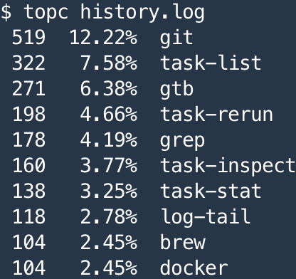

# Demo CLI topc

本演示通过实现一个名为 topc 的自定义命令，来展示如何在真实环境中使用之前所学的各种 CLI 基础知识。

同时，也会展示通用的分析问题、解决问题的不同思路，供大家参考、学习。

在现实世界中当我们去满足真实的用户需求时，需要我们在权衡各种限制条件（约束）后做出最终的平衡，答案往往不是 0 或 1 这种简单的二选一，总是需要在 0 和 1 之间的找到某个平衡的位置，而且随着条件的变化，答案的位置也会随之变化，不会有永远的最佳答案或正确答案。

我们会去追求“完美”，但达到“完美”一定是基于当前情况的各种妥协，寻找最佳的平衡而已。

所以，大家在解决实际问题的过程中，务必了解这一点：平衡。不要无谓的钻牛角尖，浪费自己宝贵的时间，还有，宝贵的头发。

最后，现实世界中处理问题同样也有数不清的细节要考虑，这里在 demo 中会做适当的忽略，有些忽略会表述出来，有些忽略可能没有显示的说明。希望不要对大家造成不必要的困扰。

任何疑问、困惑或者建，都欢迎大家随时群聊、私聊进行讨论。

## 需求描述

这里我们要实现一个用户自定义命令（command）：`topc` 。

当用户执行该命令时，需要通过参数提供一个包含历史命令的文件，如：

```shell
topc history.log
```

本 demo 提供了供测试的样例文件：`history.log`，可以在当前目录下找到，内容如以下代码片段所示：

```shell
head history.log
exit
ll
git
sudo snap install shell2http
shell2http -cgi /cat "cat /tmp/abc.txt" POST:/top "cat | jq . >> /tmp/abc.txt; echo >> /tmp/abc.txt; echo Ok"
telnet -nltp
netstat -nltp
nohup shell2http -cgi /cat "cat /tmp/abc.txt" POST:/top "cat | jq . >> /tmp/abc.txt; echo >> /tmp/abc.txt; echo Ok" &
ll
cat nohup.out
```

`topc` 命令将会对文件内容进行分析，统计每个命令出现的次数，最终输出 Top 排行榜，列出使用次数最多的十个命令。



### 具体要求

* 按次数从多到少进行排列，次数一样的，按照字母升序排列
* 文件不存在时要给出适当的提示信息（stderr、non-zero exit code）
* 如果命令里出现了管道的使用，需要将管道里的每个命令都要统计次数，不能只统计第一个命令而忽略后面的命令
* 如果命令行的第一个单词是以下命令，则忽略之，取其后面的命令进行计数
  * sudo
  * nohup
* 如果命令行的第一个命令以相对路径或绝对路径的方式出现，则去掉路径部分，只取命令名字本身进行计数，如：
  * ./scripts/task-list -> task-list
* 忽略以下极其常见且简单的命令
  * ls
  * ll
  * cd
  * echo
  * cat
  * vim
* 某些命令行的可能存在一个或多个前置的空格，需要忽略掉
* 可以只针对所提供示例文件进行编写，不必考虑更多复杂情况（`$(... $(...))`）

## 我应该学到什么

* foo
* bar
* 管道的思想

